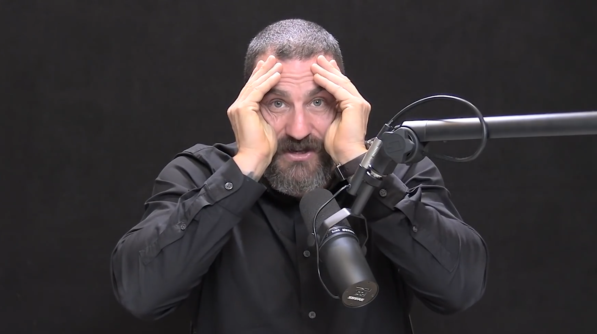

+++
title = "Конспект видео Optimizing Workspace for Productivity, Focus, & Creativity | Huberman Lab Podcast #57"
slug = "huberman-optimizing-workspace"
date = 2022-11-05
updated = 2022-11-05
template = "post.html"
+++

# Конспект видео [Optimizing Workspace for Productivity, Focus, & Creativity | Huberman Lab Podcast #57](https://www.youtube.com/watch?v=Ze2pc6NwsHQ)

## Освещение

Во время работы находитесь в настолько ярко освещённой среде, насколько возможно. Конечно, при этом стоит ограничить яркость чтобы свет не резал глаза.

### Первая фаза (0 — 8 часов после пробуждения)

Первая фаза [циркадного ритма](https://ru.wikipedia.org/wiki/циркадный_ритм) лучше подходит для аналитической, точной работы.

Для такой работы требуется быть бдительным и проснувшимся. Лучше включить верхний свет и настольную лампу, желательно с холодным синим светом.

### вторая фаза (9 — 16 часов после пробуждения)

Лучше выключить верхний свет и оставить настольную лампу, снизить количество синего света.

### Третья фаза (17 — 24 часа после пробуждения)

Уменьшите яркость до минимально достаточного для работы уровня.

## Положение тела

Положение тела тоже влияет на бодрость.

Когда взгляд опущен вниз, например, на экран ноутбука, стоящего на столе, активизируется механизм засыпания.

Взгляд прямо или вверх сохраняет концентрацию внимания.

Поэтому экран желательно расположить на уровне глаз или чуть выше.

Если спина откинута назад или ноги лежат выше уровня пояса, активизируются нейроны, отвечающие за засыпание.

## Два типа зрительного восприятия

Существует два типа зрительного восприятия — сфокусированный (magnocellular крупноклеточный) и расфокусированный (parvocellular, мелкоклеточный).

Чтобы сфокусироваться на объекте, нужно чтобы он находился перед глазами и не занимал слишком широкую область (можно приложить руки к бокам головы, как на изображении, и проверить, помещается ли объект работы в область обзора.

Желательно чтобы монитор помещался в эту область. Если монитор занимает бóльшую площадь, активизируется широкий, расфокусированный режим зрения, что мешает сосредоточенной работе.

Когда взгляд сфокусирован, глаза устают, поэтому нужно каждые 45 минут давать глазам отдохнуть минут пять и посмотреть в пространство. Важно не смотреть в телефон в это время, так как глаза вернутся в сфокусированный режим.

## cathedral effect

В помещении с высоким потолком, человек склонен к абстрактным и возвышенным мыслям.

И наоборот, в помещении с низким потолком улучшается предметное и буквальное мышление.

Можно использовать кепку с козырьком как альтернативу низкому потолку, это позволит сосредоточиться на аналитической работе.

Нахождение в помещении с высоким потолком или под открытым небом хорошо для брейншторма, построения планов, написания стихов.

## Музыка и шум

Звуки влияют на когнитивные способности.

Избегайте работы в местах с постоянным монотонный шумом вентилятора, кондиционера или обогревателя. Такой шум утомляет и снижает когнитивные способности.

Белый шум и его вариации, такие как коричневый и розовый шум могут кратковременно повышать когнитивные способности за счет того, что они бодрят своей резкостью и повышают бдительность, но на долгом промежутке времени они утомляют. Их можно использовать для того чтобы сфокусироваться, а потом выключить.

Бинауральное колебание с частотой около 40 герц стимулирует мозг, повышая его способность к запоминанию и обучению.
Лучше начать слушать его незадолго до начала работы чтобы мозг успел настроиться.
[Ютуб-канал с описанным бинауральным колебанием.](https://www.youtube.com/c/BinauralRelaxation)

## Отвлечения

Отвлечения губительны для сфокусированной работы.
Проблема не в потере нескольких минут на то, что отвлекло, а в том что после отвлечения сложно вернуться в сфокусированный режим.

Чтобы противостоять отвлекающим людям, нужно не поворачиваться к ним когда они к вам обращаются, а отвечать глядя в монитор. Так разговор не затянется надолго. Можно просто на всё отвечать «нет», глядя в монитор.

Помогает индикатор того что вас нельзя отвлекать — табличка на двери или на столе, или лампочка.

## Сидеть или стоять во время работы?

Лучше чередовать. Долгое сидение приводит ко проблемам с сердечно-сосудистой системой, с пищеварением, с позвоночником. Долгое стояние ненамного лучше. Мы не предназначены для того чтобы сидеть, ни для того чтобы стоять целый день.

Лучше завести стол с изменяемой высотой. Это позволит избежать проблем со здоровьем и немного повысит когнитивные функции.
Рекомендуется проводить половину рабочего времени сидя и половину — стоя.
Если устали стоять, и хотите облокотиться на стол, лучше сесть чем облокачиваться.

Стоит ли объединять рабочее место и дорожку для ходьбы или велотренажёр?
Исследования показыват что активные рабочие места не влияют на когнитивные функции.
