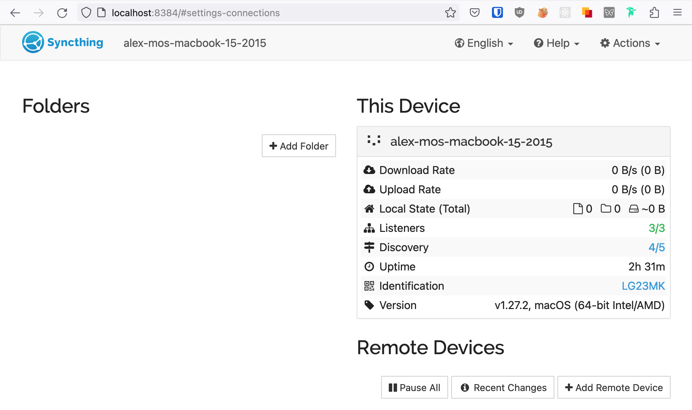
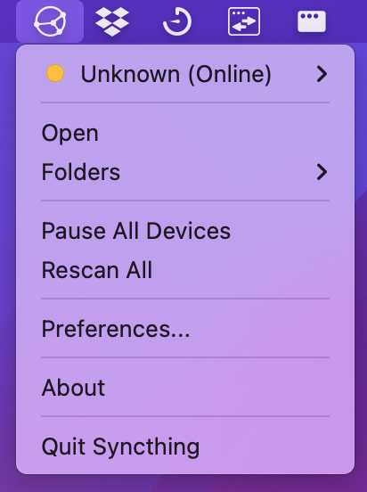
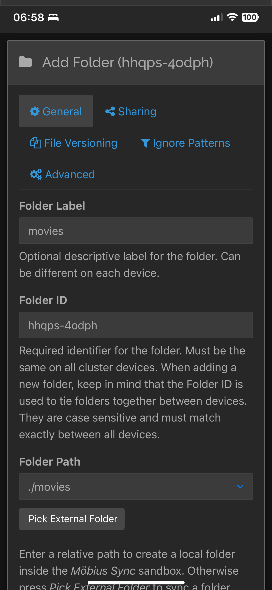
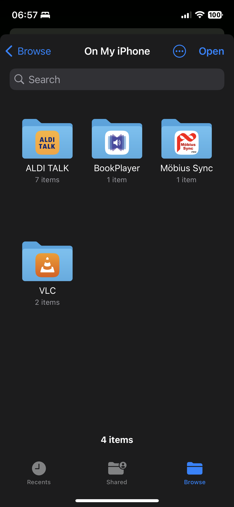
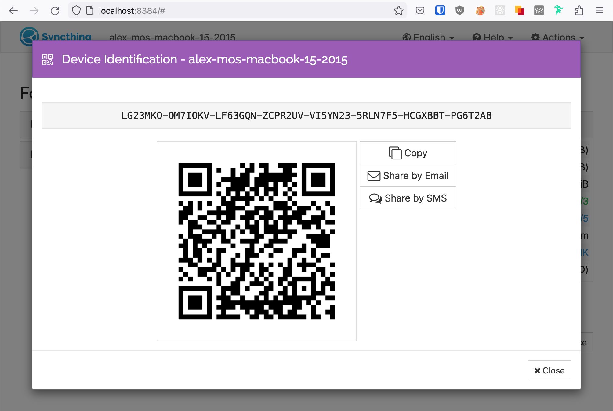
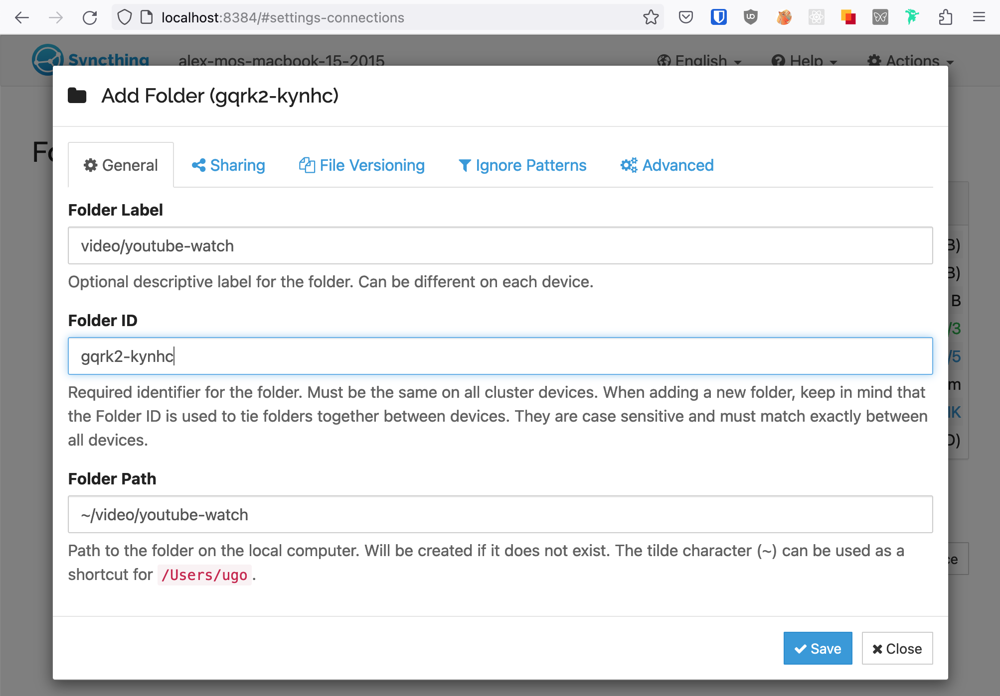
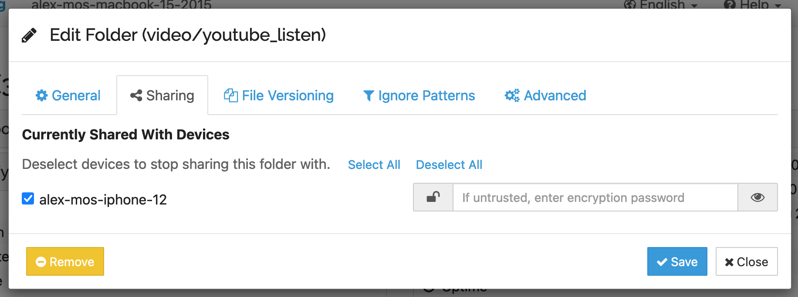
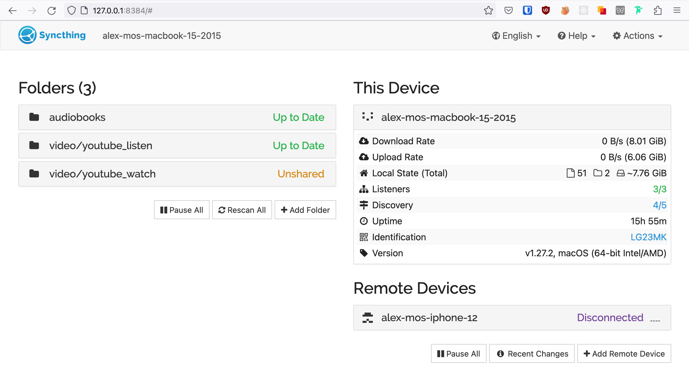

Syncthing — это программа, которая синхронизирует папки между любыми устройствами.

Грубо говоря, это как облачный сервис синхронизации файлов, вроде Dropbox, Яндекс-диска или Google Drive, только бесплатно и без искусственных ограничений по объёму.

Кроме того, для использования Syncthing не нужно заводить аккаунт пользователя. У каждого устройства, на котором запущена программа, есть идентификатор. Для того чтобы синхронизировать папку с устройством, достаточно знать только его.

В отличие от коммерческих сервисов, Syncthing не требует заводить специальную папку, например, `Dropbox`, в которой будут лежать все файлы. Вместо этого, можно выбрать любые папки и синхронизировать их с любыми устройствами.

Например, на моём ноутбуке есть папки
* `audiobooks` — туда я скачиваю аудиокниги. Я хочу чтобы они появлялись у меня на телефоне.
* `youtube_video` — скачанные с ютуба видео. Обычно я смотрю их на айпаде. Хочу чтобы они отправлялись туда.
* `movies` — фильмы. Пусть они синхронизируются с компьютером, подключенным к телевизору в гостиной, и с компьютером в другом городе, куда я иногда приезжаю.

С Syncthing это легко сделать.

## Установка и настройка

### macOS

1. Установить приложение:

    `brew install syncthing`

2. Запустить приложение как сервис, чтобы оно работало в фоновом режиме:
    
    `brew services start syncthing`

3. Открыть в браузере http://localhost:8384
    
    Вы увидите веб-интерфейс:
    
    

4. По желанию, для того чтобы не вспоминать адрес веб-интерфейса каждый раз когда нужно открыть приложение, можно установить десктопное приложение, которое создаёт иконку в трее, по клику на которую можно открыть интерфейс:

    `brew install --cask syncthing`

    

### iOS

Для iOS существует неофициальный клиент [Möbius Sync](https://www.mobiussync.com).

Из-за ограничения iOS, он синхронизирует файлы только когда приложение запущено и активно.

Можно указывать папки для синхронизации, которые принадлежат другим приложениям, например, `youtube_video` у меня синхронизируется прямо в папку [VLC-плеера](https://www.videolan.org/vlc/download-ios.html), а `audiobooks` — в папку [Bookplayer](https://github.com/TortugaPower/BookPlayer). Для этого при добавлении папки следует в **Folder Path** нажать **Pick External Folder** и выбрать нужную папку.

|  |  |
| ---- | ---- |

## Связывание устройств

У каждого устройства существует
* **Название**. Оно отображается в списке связанных устройств. Его можно менять.

    Например, `alex-mos-macbook-15-2015`

* **Идентификатор**. Набор символов, которым нужно поделиться чтобы привязать одно устройство к другому.

    Например, `LG23MKO-OM7IOKV-LF63GQN-ZCPR2UV-VI5YN23-5RLN7F5-HCGXBBT-PG6T2DB`

## Синхронизация папки

Для того чтобы синхронизировать содержимое папки с другим устройством, нужно нажать **Add Folder** и указать
* **Folder Label** — название папки, которое будет отображаться в списке.

    Например, `youtube-watch`.

* **Folder Path** — путь к папке. Можно указать путь как к существующей папке, так и к несуществующей. В этом случае она будет создана.

    Например, `~/video/youtube-watch`.

**Folder ID** — это идентификатор папки. Он создастся автоматически.

После этого можно перейти во вкладку **Sharing** и выбрать устройства, с которыми вы хотите поделиться этой папкой:

После того как устройство выбрано, нужно нажать **Save**, и на выбранных устройствах появится уведомление о том, что с ними поделились папкой.
Для добавления папки нужно выбрать **Folder Label** и **Folder Path**.

Теперь содержимое этих папок будет автоматически синхронизироваться на всех выбранных устройствах.

